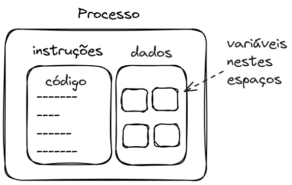
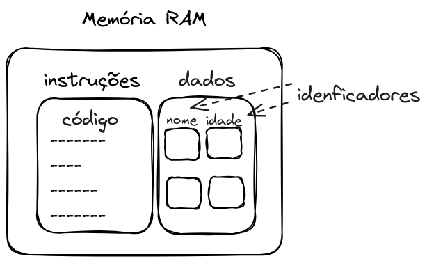

# Variáveis e tipos de dados

Aqui abordaremos as maneiras de organizar e utilizar a memória internamente ao algoritmo. Já tivemos uma noção inicial do seu uso em entrada e saída de dados, e agora os observaremos esse ponto mais a fundo.

Os dados fazem parte da matéria-prima básica na execução dos sistemas computacionais. Com eles podemos processá-los, transformálos, armazená-los e apresentá-los, ou seja, as tarefas que um computador é capaz de realizar. Com isto, é de fundamental importância compreender seu funcionamento dentro dos algoritmos.

:::info Informação
**Dado** e **informação** são conceitos distintos. Uma informação é um dado com valor. Por exemplo quando observamos a data 19 de abril, temos um dado. Ao sabermos que este é o dia do índio, temos uma informação.
:::

## Variáveis

Para que um código possa ser executado por um processador, é necessário que ele seja alocado pelo sistema operacional na memória RAM. Um código em momento de execução é chamado de **processo**. A alocação, organização e execução de processos em um sistema computacional é uma das tarefas do sistema operacional.


Quando falamos sobre variáveis, começamos a observar que estes são espaços na memória RAM em que os dados serão armazenados. Tanto o código como as variáveis são armazenados na memória RAM para serem executados pelo processador.

Podemos imaginar a memória como sendo um grande armário, que possui um grande número de gavetas. Dentro de cada uma das gavetas pode ser armazenado um dado.



No desenvolvimento de algoritmos, há a necessidade de identificar uma característica nos dados. Em específico, se tais dados são **constantes** ou **variáveis** no decorrer da execução do algoritmo.

Um valor **variável** é aquele que pode ser modificado no decorrer da execução do algoritmo.
 
**Exemplos**
- Valores indicados pelo usuário
    - Os valores para A e B são 15 e 50
    - O lado do quadrado
- Resultados intermediários de operações matemáticas
- Estado de alguma operação ou ação
    - A janela está aberta
    - A janela está fechada

### Identificadores de variáveis

Um **identificador** é um nome, que corresponde a um dado a ser utilizado no algoritmo. comumente dizemos que um identificador é o **nome da variável**. A escolha do identificador deve sempre ser de acordo com a função da variável no algoritmo, de forma a facilitar o melhor entendimento do código.

Em nossa analogia de gavetas, podemos imaginar que o identificado é um rótulo em cada gaveta, que descreve o que nela contém.



Para criar um identificador, algumas regras devem sempre ser seguidas:
1. Sempre deve começar com caractere alfabético (a-z, A-Z).
1. Podem ser seguidos por um ou mais caracteres alfabéticos, numéricos (0-9) ou _underscore_ ( \_ ).
1. Caracteres especiais não podem ser utilizados;
1. Não podem ser utilizadas palavras reservadas da linguagem. A lista de palavras reservadas é específica de cada linguagem. 

**Exemplos**
- Gama
- X
- notas
- soma
- Soma
- SoMA_Total

**Exercício**
- Identifique se os identificadores a seguir são válidos ou inválidos

    - 2tempos
    - verdadeiro-ou-falso
    - janela_aberta
    - nome
    - Tamanho do lado
    - area
    - SomaTotal
    - media/2

#### Convenções

Boa parte dos programadores seguem alguma convenção ao definir os identificadores, para que o código seja mais uniforme. Estas práticas costumam facilitar o entendimento do código.

Algumas convenções para identificadores são:

- ***camelCase*** : palavras são escritas juntas sem espaço, e cada palavra inicia com uma letra maiúscula. Exemplos:
    - idDoUsuario
    - idadePessoa
    - nomeFuncionario
- ***snake_case*** : palavras são separadas por *underline* (_) entre elas. Exemplos:
    - id_do_usuario
    - idade_pessoa
    - nome_funcionario
- ***PascalCase*** : semelhante ao *camelCase*, porém a letra inicial também é maiúscula. Exemplos:
    - IdDoUsuario
    - IdadePessoa
    - NomeFuncionario
- ***UPPER_CASE*** : todas as letras em maiúsculas, separadas por *underline*. É amplamente utilizada para a definição de constantes (veremos adiante). Exemplos:
    - ID_DO_USUARIO
    - IDADE_PESSOA
    - NOME_FUNCIONARIO

Não existe uma maneira correta de definir os identificadores, porém estas são utilizadas cotidianamente.

### Declaração de variáveis

Já vimos que quando falamos de dispositivos computacionais, as variáveis correspondem a uma área na **memória** para o armazenamento de dados.

É fundamental que o **tipo de dado** de cada **variável** seja observado e utilizado sempre de maneira correta.

Antes de fazer o uso da variável, precisamos declará-la. A declaração da variável serve para informar ao sistema operacional que o algoritmo precisa de memória para armazenar dados para que possa ser executado.

Comumente, colocamos a declaração de variáveis no início do algoritmo.

:::info Informação
Algumas linguagens de programação requerem que a declaração de variáveis seja realizada explicitamente no início do código, ocasionando em erros caso isto não aconteça.
:::

Na declaração das variáveis é necessário informar qual tipo de dado poderá ser armazenado naquela variável.

**Exemplo**
- declaração de uma variável chamada `idade`, que armazenará valores do tipo inteiro.

<Tabs groupId='language'>
  <TabItem value="pseudocodigo" label="Pseudocódigo" default>

  ```c
  //variáveis
  inteiro: idade;
  ```

  </TabItem>
  <TabItem value="java" label="Java">

  ```javascript
  //variáveis
  int idade;
  ```

  </TabItem>
  <TabItem value="python" label="Python">

  ```python
  #variáveis
  idade : int
  ```

  </TabItem>

  <TabItem value="c" label="C">

  ```c
  printf("Olá Mundo")
  ```

  </TabItem>

</Tabs>

**Exercício**  
- Identifique se o tipo de dado de cada variável está correto ou incorreto.

    - inteiro: endereço

    - inteiro: nro_gatos

    - inteiro: qtde_itens

    - real: soma_total

    - inteiro: soma_total

    - caractere: idade

    - lógico: idade

**Exercício**  
- Identifique se o tipo de dado de cada variável está correto ou incorreto.

    - inteiro: idade

    - real: nome

    - lógico: janela_aberta

    - real: peso

    - real: tamanho

## Tipos de dados

Um tipo de dado pode ser criado a partir de outros tipos de dados. Os tipos de dados iniciais já presentes em uma linguagem de programação são chamados de **tipos primitivos de dados**. Aqui observaremos os tipos de dados **inteiro**, **real**, **caractere** e **lógico**.

### Inteiro

### Real

### Lógico

### Caractere


## Inteiro

Um **inteiro** é uma informação numérica, que compreende valores que correspondem ao conjunto dos números inteiros (positivos, nulo e negativos)

**Exemplo**  
- O Campus possui 4 construções;
- Estão construindo 22 casas novas no bairro vizinho;
- O cachorro tem 8 anos de idade.

**Observação**  
Nas linguagens de programação, é comum observarmos o tipo inteiro como **int**.

## Real

O tipo de dado **real** é aquele que possui um valor que está compreendido no conjunto dos números reais. São abordados os números negativos, positivos e nulo, considerando as casas decimais.

**Exemplo**  
- A distância do portão até a sala é de 25,7 metros.
- O saldo bancário é de R\$ 357,32.
- O saldo bancário é de R\$ -169,20.

**Observação**  
Nas linguagens de programação, é comum observarmos o tipo real como **float** ou **double**.

## Caractere

Os dado do tipo **caractere** são aqueles que pertencem ao conjunto de valores alfanuméricos (0-9), alfabéticos (a-z, A-Z) e especiais (\!\@\#\$\%\*+-/, dentre outros).

**Exemplo**  
- O professor disse: "Não use o celular durante a aula!".
- Ao final do jornal, ele sempre fala "Boa noite".
- O nome do presidente do clube é "Celso da Silva".

**Observação**  
Nas linguagens de programação, é comum observarmos o tipo caractere como **string** (ou str).

## Lógico

Um dado do tipo **lógico** é aquele em que dois valores podem ser asssumidos: verdadeiro ou falso.

**Exemplo**  
- A janela está aberta.
- O carro está ligado.
- A bicicleta está parada.

**Observação**  
Nas linguagens de programação, é comum observarmos o tipo lógico como **bool** (ou boolean).

**Exercícios**  
Observe qual é o tipo de dado em cada situação ([FORBELLONE, pg. 20](https://plataforma.bvirtual.com.br/Leitor/Publicacao/200078/pdf/44)):

- A placa "Pare!" tinha 2 furos de bala.

- Josefina subiu 5 degraus para pegar uma maçã boa.

- Alberta levou 3,5 horas para chegar ao hospital.

- Astrogilda mandou pintar em um lote de 10 camisetas: "Preserve o meio ambiente", e ficou devendo R\$ 150,00 para a estamparia Pinte e Borde a ser pago em 3 parcelas.

- Felisberto recebeu sua 18ª medalha por ter alcançado a marca de 578,3 segundos nos 100 metros rasos.

## Referências
- [FORBELLONE, André Luiz Villar; EBERSPÄTCHER, Henri Frederico. Lógica de programação: A construção de algoritmoss e estruturas de dados com aplicações em Python. 4.ed. São Paulo: Pearson; Porto Alegre: Bookman, 2022](https://plataforma.bvirtual.com.br/Leitor/Publicacao/200078/pdf)

 
## Apresentações
- [HTML](pathname:///slides/Algoritmos/02-Basicos/04-Tipos_primitivos_de_dados.html)
- [PDF](pathname:///slides/Algoritmos/02-Basicos/04-Tipos_primitivos_de_dados.pdf)