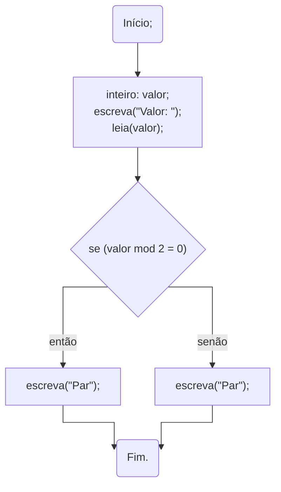

import Tabs from '@theme/Tabs';
import TabItem from '@theme/TabItem';

# Seleção composta

Vamos partir do seguinte exemplo:
- Desenvolva um algoritmo em que o usuário digita um valor. De acordo com o valor mostre a seguinte mensagem:
    - *"Par"* caso o número digitado seja par;
    - *"Ímpar"* caso o número digitado seja ímpar.
<!-- --- -->

<Tabs groupId='language'>
  <TabItem value="portugol" label="Portugol" default>

  ```c showLineNumbers
  início
  //variáveis
  inteiro: valor;
  escreva("Valor: ");
  leia(x);

  //processamento e saída
  se(x mod 2 = 0)           //<-- Verifica se o valor é par
    então 
      início
        escreva("Par");
      fim;
  se(x mod 2 <> 0)          //<-- Verifica se o valor é ímpar
    então
      início
        escreva("Ímpar");
      fim;
  fimse;
  ```

  </TabItem>
  <TabItem value="java" label="Java">

  ```c showLineNumbers
  //variáveis e entrada
  int valor;
  Scanner entrada;
  entrada = new Scanner(System.in);
  System.out.println("Valor: ");
  valor = entrada.nextInt();
  entrada.close();

  //processamento e saída
  if( valor %2 == 0 )       //<-- Verifica se o valor é par
  { 
    System.out.println("Par");
  }
  if( valor %2 != 0 )       //<-- Verifica se o valor é ímpar
  { 
    System.out.println("Ímpar");
  } 

  ```

  </TabItem>
  <TabItem value="python" label="Python">

  ```python showLineNumbers
  #variáveis e entrada
  valor = int(input("Valor: "))

  #processamento e saída
  if valor % 2==0:        #<-- Verifica se o valor é par
    print("Par")
  if valor % 2!=0:        #<-- Verifica se o valor é par
    print("Ímpar")
  ```

  </TabItem>
</Tabs>


Observe no algoritmo acima que os testes são realizados duas vezes. E incluse, perceba que os resultados não se sobrepõem, visto que as condição são o inverso uma da outra. Ou o número é par ou é impar, não há como ser ambos simultaneamente.

<!-- --- -->

A seleção composta é uma ampliação da seleção simples. A ideia é que podemos ter duas escolhas, e executar uma (e apenas uma) delas. Uma para o caso do resultado da expressão ser `verdadeiro` e outra para resultado `falso`. 

<!-- --- -->

## Sintaxe

<Tabs groupId='language'>
  <TabItem value="portugol" label="Portugol" default>

  ```c showLineNumbers
  se(<expressão>)
    então
      início
        //código a ser executado caso o 
        //resultado da <expressão> seja verdadeiro.
        //aqui podem existir várias linhas
      fim;
    // highlight-start
    senão
      início
      //código a ser executado caso o 
        //resultado da <expressão> seja falso.
        //aqui podem existir várias linhas
      fim;
    // highlight-end
  fimse;
  ```

  </TabItem>
  <TabItem value="java" label="Java">

  ```c showLineNumbers
  if(<expressão>)
  {
    //código a ser executado caso o 
    //resultado da <expressão> seja verdadeiro.
    //aqui podem existir várias linhas
  }
  // highlight-start
  else
  {
    //código a ser executado caso o 
    //resultado da <expressão> seja falso.
    //aqui podem existir várias linhas
  }
  // highlight-end
  ```

  </TabItem>
  <TabItem value="python" label="Python">

  ```python showLineNumbers
  if <expressão>:
    #código a ser executado caso o 
    #resultado da <expressão> seja verdadeiro.
    #aqui podem existir várias linhas
  # highlight-start
  else:
    #código a ser executado caso o 
    #resultado da <expressão> seja falso.
    #aqui podem existir várias linhas
  # highlight-end
  ```

  </TabItem>
</Tabs>

<!-- --- -->

Desta forma, o exercício anterior poderia ser resolvido da seguinte maneira:

<Tabs groupId='language'>
  <TabItem value="portugol" label="Portugol" default>

  ```c showLineNumbers
  início
  //variáveis
  inteiro: valor;
  escreva("Valor: ");
  leia(x);

  //processamento e saída
  se(x mod 2 = 0) //<-- Verifica se o valor é par
    então 
      início
        escreva("Par");
      fim;
    // highlight-start
    senão
      início
        escreva("Ímpar");
      fim;
    // highlight-end
  fimse;
  ```

  </TabItem>
  <TabItem value="java" label="Java">

  ```c showLineNumbers
  //variáveis e entrada
  int valor;
  Scanner entrada;
  entrada = new Scanner(System.in);
  System.out.println("Valor: ");
  valor = entrada.nextInt();
  entrada.close();

  //processamento e saída
  if( valor %2 == 0 )
  { 
    System.out.println("Par");
  }
  // highlight-start
  else
  { 
    System.out.println("Ímpar");
  } 
  // highlight-end

  ```

  </TabItem>
  <TabItem value="python" label="Python">

  ```python showLineNumbers
  #variáveis e entrada
  valor = int(input("Valor: "))

  #processamento e saída
  if x%2==0:
    print("Par")
  # highlight-start
  else:
    print("Ímpar")
  # highlight-end
  ```

  </TabItem>
</Tabs>

<!-- --- -->


Podemos observar melhor a solução deste problema utilizando fluxogramas:


Observe que há dois caminhos possíveis, e qual caminho seguir depende do resultado da expressão.
<!-- --- -->


## Referências
::: {#refs}
:::

