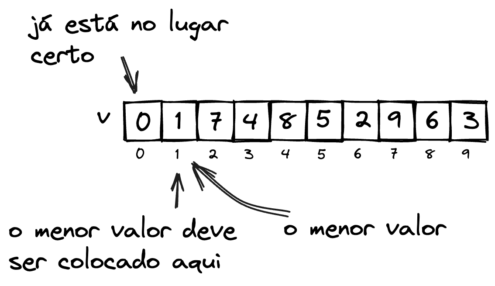
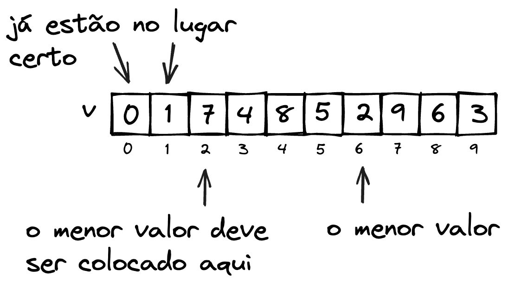
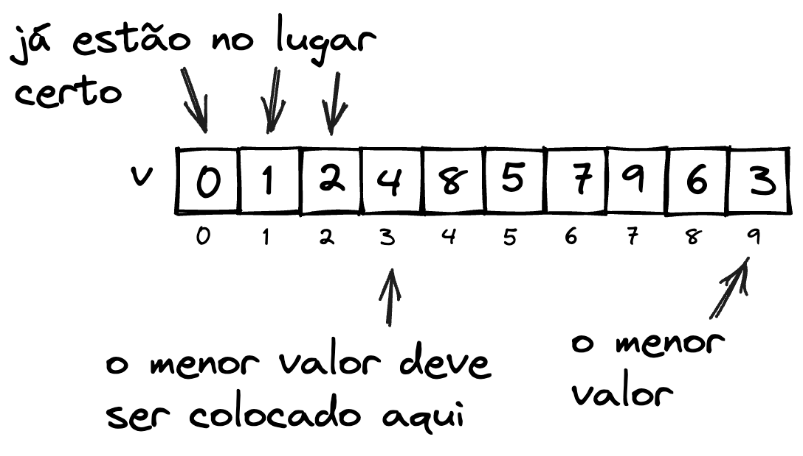

# Selection Sort

O algoritmo do ***Selection Sort*** consiste em procurar na entrada o menor valor existente, e trocá-lo pelo valor na posição inicial. Após este passo, observa-se que o elemento na posição inicial já está em sua posição correta. Este procedimento é repetido para a posição seguinte, até que toda a entrada tenha sido percorrida.

**Exemplo**

Considere como entrada o vetor $v$ apresentado abaixo:


É definido como $i$ a posição inicial do vetor, e o menor valor do conjunto a partir da posição $i$ é procurado.


Sabendo onde está o menor valor da entrada, troca-se este valor pelo da posição $i$.


Observe que agora o menor valor já está no lugar correto. Após a troca, o índice $i$ avança, e o processo é repetido. Como o menor valor da posição $i$ em diante é o próprio elemento na posição $i$, trocá-lo de lugar não terá alterações de posição.





Com isto, o índice $i$ avança novamente. Perceba que todos os elementos à esquerda de $i$ já estão ordenados.





O elemento na posição $i$ é trocado pelo menor elemento da posição $i$ em diante...


E novamente, após a troca temos mais um elemento que está na posição correta.



Este processo se repete até que $i$ percorra toda a entrada.


```javascript
public static void selectionSort(int[] v){
    int i, j, menor_val, menor_pos;

    for(i=0;i<v.length-1;i++){
        //procura pelo menor valor
        menor_val = v[i]
        menor_pos = i
        for(j=i+1;j<v.length;j++){
            if(v[j]<menor_val){
                menor_val = v[j];
                menor_pos = j;
            }
        }
        //troca o elemento em i pelo menor valor
        troca(v, i, menor_pos);
    }
}
```

```python
def selectionSort(v):
    for i in range(0, len(v)-1):
        #procura pelo menor valor
        menor_val = v[i]
        menor_pos = i
        for j in range(i+1, len(v)):
            if v[j] < menor_val:
                menor_val = v[j]
                menor_pos = j
        #troca o elemento em i pelo menor valor
        troca(v, i, menor_pos)
```

## Tipo de dados genéricos

## Recursividade

O algoritmo Selection Sort pode ser implementado de maneira recursiva, porém não há vantagens em sua utilização. Será necessário chamar a recurão $n-1$ vezes, rapidamente chegando a um estouro de pilha.

```javascript
public static void selectionSortRec(int[] v){
    selectionSortRec_(v, 0);
}

public static void selectionSortRec_(int[] v, ini){
    int menor_val, menor_pos, j;
    if(ini < v.length-1){
        //procura pelo menor valor
        menor_val = v[ini];
        menor_pos = ini;
        for(j=ini+1;j<v.length;j++){
            if(v[j]<menor_val){
                menor_val = v[j];
                menor_pos = j;
            }
        }
        //troca o elemento em i pelo menor valor
        troca(v, ini, menor_pos);
        //realiza a chamada recursiva a partir de ini+1,
        // dado que os valores até ini estáo ordenados
        selectionSortRec_(v, ini+1);
    }
}
```

```python
def selectionSortRec(v):
    selectionSortRec_(v, 0)


def selectionSortRec_(v, ini):
    if ini < v.length-1:
        #procura pelo menor valor
        menor_val = v[i]
        menor_pos = i
        for j in range(ini+1, v.length):
            if v[j] < menor_val:
                menor_val = v[j]
                menor_pos = j
        #troca o elemento em i pelo menor valor
        troca(v, ini, menor_pos)
        #realiza a chamada recursiva a partir de ini+1,
        # dado que os valores até ini estáo ordenados
        selectionSort(v, ini+1)
```

## Análise

## Referências

[BRUNET, J.A. Estruturas de dados e Algoritmos: Ordenação por Comparação: Selection Sort. Notas de aula. Universidade Federal de Campina Grande. Campina Grande, 2019. ](https://joaoarthurbm.github.io/eda/posts/selection-sort/)