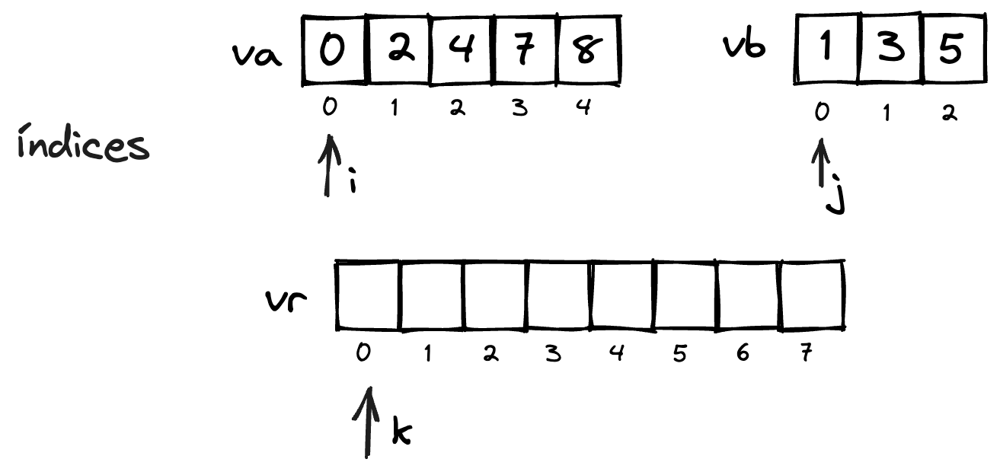

# Merge Sort

O algoritmo ***Merge Sort***, também chamado de **ordenação por intercalação** é um algoritmo do tipo divisão e conquista, ou seja, divide o problema em sub-problemas e resolve um sub-problema por vez até que o problema completo seja resolvido.

Como a maioria dos algoritmos de divisão e conquista, o Merge Sort pode ser implementado de maneira recursiva.

## Fases

A abordagem utilizando recursividade é a forma mais intuitiva do algoritmo, que pode ser dividida em duas fases: divisão (*split*) e intercalação (*merge*).

### Intercalação

Inicialmente abordaremos a segunda fase do algoritmo, a intercalação. Esta fase consiste em receber como entrada dois vetores já ordenados, e a partir destes, gerar um novo vetor ordenado possuindo todos os elementos. Observe que aqui há uma restrição: **os dois vetores da entrada devem estar ordenados**.

**Exemplo**

Considere como entrada para a fase dois vetores $va$ e $vb$:


É necessário que exista um outro vetor para que os valores ordenados sejam guardados. Alocamos um vetor resultado $vr$. Também é necessário acompanhar quais valores observar (índices $i$ e $j$) e onde os valores deverão ser armazenados em $vr$ (índice $k$). Todos os índices iniciam nas posições 0 de cada vetor.



Como os vetores $va$ e $vb$ estão ordenados, naturalmente a primeira posição possui os menores valores. Então precisamos observar os valores em $va$ e $vb$ que estão armazenados nas posições $i$ e $j$. O menor deles deve ser armazenado em $vr$ na posição $k$.


Após armazenar o menor dos valores apontados por $i$ ou $j$ em $k$, os índices devem ser incrementados. Como o menor dos dois elementos era aquele apontado por $i$, $i$ foi incrementado para que o próximo valor possa ser comparadado. $k$ deve ser incrementado também, dado que agora o próximo menor valor deve ser armazenado na próxima posição.


Este processo é repetido novamente, enquanto os índices $i$ e $j$ estejam indicando posições válidas dentro dos vetores $va$ e $vb$. Observe que neste caso o menor valor é aquele apontado por $j$..


O menor vaoor é copiado e os índices novamente são incrementados.


Observe que o processo que se repete aqui é este:

```javascript
while( i < va.length && j < vb.length){
    if(va[i]<=vb[j]){
        vr[k] = va[i];
        i++;
    }else{
        vr[k] = vb[j];
        j++;
    }
    k++;
}
```

```python
while i < len(va) and j < len(vb):
    if va[i] <= vb[j]:
        vr[k] = va[i]
        i+=1
    else:
        vr[k] = vb[j]
        j+=1
    k+=1

```

a repetição ocorre enquanto ambos os índices $i$ e $j$ estejam apontando dentro de seus respectivos vetores. 

No exemplo, neste ponto $vb$ já possui todos os seus valores em $vr$, dado que $j$ indica uma posição fora de $vb$. Aqui resta incluir os demais elementos de $va$ em $vr$. Aqui, como um dos índices já está fora do vetor, repetição é finalizada. Então é necessário testar individualmente cada índice, e se ainda houverem valores não incluídos, incluí-los.

```javascript
while(i<va.length){
    vr[k] = va[i];
    i++;
    k++;
}

while(j<vb.length){
    vr[k] = vb[j];
    j++;
    k++;
}
```

```python
while i < len(va):
    vr[k] = va[i]
    i+=1
    k+=1

while j < len(vb):
    vr[k] = vb[j]
    j+=1
    k+=1
```


quando ambos os índices $i$ e $j$ já estiverem fora dos vetores $va$ e $vb$, indica que todos os valores de ambos os vetores já foram copiados para $vr$. Quando este ponto for atingido, todos os valores já estarão ordenados em $vr$ e este processo se finaliza.


O algoritmo completo:

```javascript
public static int[] mergeSort_intercalar(int[] va, int[] vb){
    //caso ambos i e j ainda apontem dentro dos vetores
    while( i < va.length && j < vb.length){
        if(va[i]<=vb[j]){ //o menor dos valores apontados por i e j deve ser incluído em vr
            vr[k] = va[i];
            i++;
        }else{
            vr[k] = vb[j];
            j++;
        }
        k++;
    }
    //caso j já esteja fora de vb, basta incluir os valores de va.
    while(i<va.length){
        vr[k] = va[i]; 
        i++;
        k++;
    }

    //caso i já esteja fora de va, basta incluir os valores de vb.
    while(j<vb.length){
        vr[k] = vb[j];
        j++;
        k++;
    }
}
```

```python
def mergeSort_intercalar(va, vb):
    #caso ambos i e j ainda apontem dentro dos vetores
    while i < len(va) and j < len(vb):
        if va[i] <= vb[j]: #o menor dos valores apontados por e j deve ser incluído em vr
            vr[k] = va[i]
            i+=1
        else:
            vr[k] = vb[j]
            j+=1
        k+=1

    #caso i esteja dentro de va, basta incluir seus valores em vr.
    while i < len(va):
        vr[k] = va[i]
        i+=1
        k+=1

    #caso j esteja dentro de vb, basta incluir seus valores em vr.
    while j < len(vb):
        vr[k] = vb[j]
        j+=1
        k+=1
```

### Divisão


## Tipo de dados genéricos

## Recursividade

## Análise

