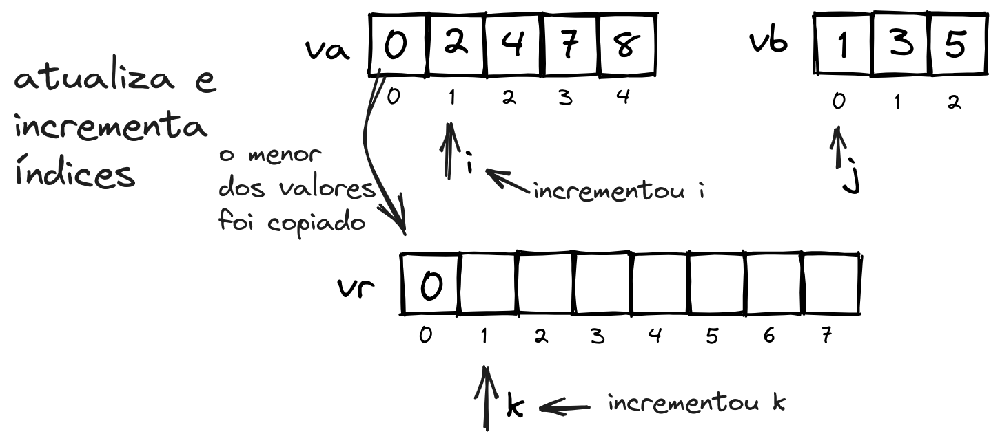
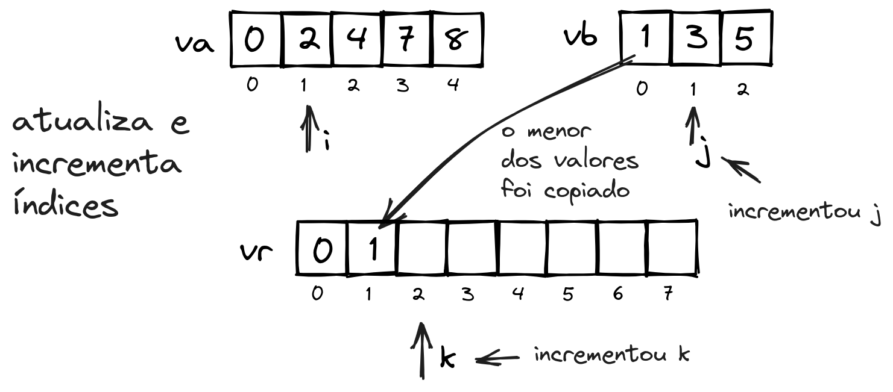
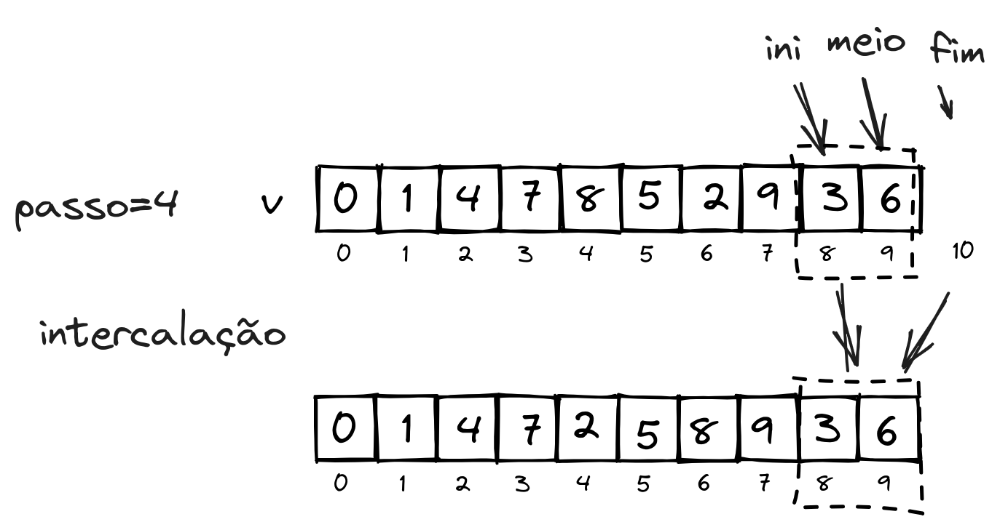

# Merge Sort

O algoritmo ***Merge Sort***, também chamado de **ordenação por intercalação** é um algoritmo do tipo divisão e conquista, ou seja, divide o problema em sub-problemas e resolve um sub-problema por vez até que o problema completo seja resolvido.

Como a maioria dos algoritmos de divisão e conquista, o Merge Sort pode ser implementado de maneira recursiva.

## Fases

A abordagem utilizando recursividade é a forma mais intuitiva do algoritmo, que pode ser dividida em duas fases: divisão (*split*) e intercalação (*merge*).

### Intercalação

Inicialmente abordaremos a segunda fase do algoritmo, a intercalação. Esta fase consiste em receber como entrada dois vetores já ordenados, e a partir destes, gerar um novo vetor ordenado possuindo todos os elementos. Observe que aqui há uma restrição: **os dois vetores da entrada devem estar ordenados**.

**Exemplo**

Considere como entrada para a fase dois vetores $va$ e $vb$:


É necessário que exista um outro vetor para que os valores ordenados sejam guardados. Alocamos um vetor resultado $vr$. Também é necessário acompanhar quais valores observar (índices $i$ e $j$) e onde os valores deverão ser armazenados em $vr$ (índice $k$). Todos os índices iniciam nas posições 0 de cada vetor.


Como os vetores $va$ e $vb$ estão ordenados, naturalmente a primeira posição possui os menores valores. Então precisamos observar os valores em $va$ e $vb$ que estão armazenados nas posições $i$ e $j$. O menor deles deve ser armazenado em $vr$ na posição $k$.


Após armazenar o menor dos valores apontados por $i$ ou $j$ em $k$, os índices devem ser incrementados. Como o menor dos dois elementos era aquele apontado por $i$, $i$ foi incrementado para que o próximo valor possa ser comparadado. $k$ deve ser incrementado também, dado que agora o próximo menor valor deve ser armazenado na próxima posição.



Este processo é repetido novamente, enquanto os índices $i$ e $j$ estejam indicando posições válidas dentro dos vetores $va$ e $vb$. Observe que neste caso o menor valor é aquele apontado por $j$..


O menor valor é copiado e os índices novamente são incrementados.



Observe que o processo que se repete aqui é este:

```javascript
while( i < va.length && j < vb.length){
    if(va[i]<=vb[j]){
        vr[k] = va[i];
        i++;
    }else{
        vr[k] = vb[j];
        j++;
    }
    k++;
}
```

```python
while i < len(va) and j < len(vb):
    if va[i] <= vb[j]:
        vr[k] = va[i]
        i+=1
    else:
        vr[k] = vb[j]
        j+=1
    k+=1

```

a repetição ocorre enquanto ambos os índices $i$ e $j$ estejam apontando dentro de seus respectivos vetores. 

No exemplo, neste ponto $vb$ já possui todos os seus valores em $vr$, dado que $j$ indica uma posição fora de $vb$. Aqui resta incluir os demais elementos de $va$ em $vr$. Aqui, como um dos índices já está fora do vetor, repetição é finalizada. Então é necessário testar individualmente cada índice, e se ainda houverem valores não incluídos, incluí-los.

```javascript
while(i<va.length){
    vr[k] = va[i];
    i++;
    k++;
}

while(j<vb.length){
    vr[k] = vb[j];
    j++;
    k++;
}
```

```python
while i < len(va):
    vr[k] = va[i]
    i+=1
    k+=1

while j < len(vb):
    vr[k] = vb[j]
    j+=1
    k+=1
```


quando ambos os índices $i$ e $j$ já estiverem fora dos vetores $va$ e $vb$, indica que todos os valores de ambos os vetores já foram copiados para $vr$. Quando este ponto for atingido, todos os valores já estarão ordenados em $vr$ e este processo é finalizado.


algoritmo completo da intercalação:

```javascript
public static int[] mergeSort_intercalar(int[] va, int[] vb){
    int i=0, j=0, k=0;
    int[] vr = new int[va.length + vb.length];

    //enquanto ambos i e j ainda apontem dentro dos vetores
    while( i < va.length && j < vb.length){
        if(va[i]<=vb[j]){ //o menor dos valores apontados por i e j deve ser incluído em vr
            vr[k] = va[i];
            i++;
        }else{
            vr[k] = vb[j];
            j++;
        }
        k++;
    }
    //caso j já esteja fora de vb, basta incluir os valores de va.
    while(i<va.length){
        vr[k] = va[i]; 
        i++;
        k++;
    }

    //caso i já esteja fora de va, basta incluir os valores de vb.
    while(j<vb.length){
        vr[k] = vb[j];
        j++;
        k++;
    }

    return vr;
}
```

```python
import numpy as np
def mergeSort_intercalar(va, vb):
    i, j, k = 0, 0, 0
    vr = np.zeros(len(va) + len(vb))
    
    #enquanto ambos i e j ainda apontem dentro dos vetores
    while i < len(va) and j < len(vb):
        if va[i] <= vb[j]: #o menor dos valores apontados por e j deve ser incluído em vr
            vr[k] = va[i]
            i+=1
        else:
            vr[k] = vb[j]
            j+=1
        k+=1

    #caso j já esteja fora de vb, basta incluir os valores de va.
    while i < len(va):
        vr[k] = va[i]
        i+=1
        k+=1

    #caso i já esteja fora de va, basta incluir os valores de vb.
    while j < len(vb):
        vr[k] = vb[j]
        j+=1
        k+=1

    return vr
```

**Atividade**
-  É realmente necessária a variável com o índice $k$?
    - como seria possível calcular o valor de $k$ sempre que necessário, sem alocar a variável?

### Divisão

A fase de divisão consiste em separar a entrada em duas partes (como seu nome já diz, *dividir*).

**Exemplo**

Tome como exemplo a seguinte entrada, com o vetor $v$:


a ideia é que a entrada seja dividida em dois novos vetores: *vetor da esquerda* ($ve$) e *vetor da direita* ($vd$).


o processo de divisão desse vetor consiste em alocar dois novos vetores e copiar os elementos um a um. Obtemos o valor de $meio$, e para o vetor $ve$ copiamos os elementos de 0 a $meio-1$


e para o vetor $vd$ realizamos o mesmo processo, porém copiando os elementos da posição $meio$ até $n-1$.


Com isto, o algoritmo para o processo de divisão trata de obter dois subvetores, $ve$ com os elementos de $v$ da posição 0 até $meio$ e $vd$ com elementos de $v$ outro das posições $meio$ a $n$.

```javascript
public static int[] vetorSubVetor_copia(int []v, int ini, int fim){
    int i, k=0;
    int[] sub_vetor = new int[fim - ini];
    
    for(i=ini; i<fim; i++){ //<- o valor na posição fim não é copiado
        sub_vetor[k] = v[i];
        k++;
    }
    return sub_vetor;
}

public static void divisao(int[] v){
    int[] ve, vd;
    int meio;

    meio = v.length/2; //obtém apenas a divisão inteira
    ve = vetorSubVetor_copia(v, 0, meio); //do início até a posição meio-1
    vd = vetorSubVetor_copia(v, meio, v.length); //de meio até tamanho-1
}
```

```python
import numpy as np
def vetorSubVetor_copia(v, ini, fim){
    k=0
    sub_vetor = np.zeros(fim-ini)
    for i in range(ini, fim): #<- o valor na posição fim não é copiado
        sub_vetor[k] = v[i]
        k+=1
    return sub_vetor
}

def divisao(int[] v){
    meio = len(v) // 2 #obtém apenas a divisão inteira
    ve = vetorSubVetor_copia(v, 0, meio); #do início até a posição meio-1
    vd = vetorSubVetor_copia(v, meio, len(v)); #de meio até tamanho-1
}

```


### Recursão

O algoritmo do Merge Sort pode ser executado recursivamente. Para tal, a entrada deve ser dividida recursivamente, chamando o próprio algoritmo de ordenação, até que possua um único elemento. Lembre-se: uma entrada que possui um único elemento já é uma entrada que está ordenada.


Após as divisões, a fase de intercalação tem início, finalizando as chamadas recursivas da fase de divisão.


Observe que os retornos das chamadas à função `mergeSort` é utilizado como entrada para a função `mergeSort_intercalar`. 

De forma completa, o algoritmo recursivo do Merge Sort pode ser definido da seguinte maneira:

```javascript
public static int[] mergeSort_rec(int[] v){
    int[] vr, ve_ordenado, vd_ordenado;
    if(v.length <=1){  // <- fim da recursão
        return v;
    }

    //Fase da divisão
    int[] ve, vd;
    int meio;

    meio = v.length/2; //divisão inteira
    ve = vetorSubVetor_copia(v, 0, meio); //do início até a posição meio-1
    vd = vetorSubVetor_copia(v, meio, v.length); //de meio até tamanho-1

    //Recursivamente, ordena os vetores da esquerda e da direita
    ve_ordenado = mergeSort_rec(ve);
    vd_ordenado = mergeSort_rec(vd);

    //Fase da intercalação
    vr = mergeSort_intercalar(ve_ordenado, vd_ordenado);

    return vr;
}
```


```python
def mergeSort_rec(v):
    if len(v) <= 1: # <- fim da recursão
        return v
    
    #Fase da divisão
    meio = len(v) // 2 #divisão inteira
    ve = vetorSubVetor_copia(v, 0, meio); #do início até a posição meio-1
    vd = vetorSubVetor_copia(v, meio, len(v)); #de meio até tamanho-1

    #Recursivamente, ordena os vetores da esquerda e da direita
    ve_ordenado = mergeSort_rec(ve)
    vd_ordenado = mergeSort_rec(vd)

    #Fase da intercalação
    vr = mergeSort_intercalar(ve_ordenado, vd_ordenado)

    return vr
```

**Atividade**
1. Na fase de divisão, quando a entrada possui uma quantidade de elementos de número ímpar, é o vetor $ve$ que fica com um elemento a menor que $vd$. Por que isso acontece?

## Tipo de dados genéricos

## Otimizações de código

Algumas otimizações de código podem ser aplicadas aqui. Uma delas é retirar a criação dos diversos vetores $ve$, $vd$ e $vr$ a cada chamada da função `mergeSort_intercalar`. A criação de um ou mais vetores no decorrer do código leva a perda de desempenho. Neste caso, um único vetor auxiliar alocado no início do algoritmo pode resolver essa situação.

Observando as Figuras na seção [Recursão](#recursão) podemos observar que a operação de intercalação sempre ocorre em valores que estão organizados continuamente no vetor de entrada $v$. Com isto, ao invés de alocarmos um novo vetor para retorná-lo podemos modificar o próprio vetor $v$ da entrada. 

Seguindo esta mesma abordagem, podemos modificar o algoritmo de intercalação, para que ao invés de criar um novo vetor utilize um vetor auxiliar e salve o resultado no próprio vetor $v$. 

```javascript
public static void mergeSort_intercalar_aux(int[] v, int ini, int meio, int fim, int[] aux){
    int i=ini, j=meio, k=ini;

    while( i < meio && j < fim ){
        if( v[i] <= v[j] ){
            aux[k] = v[i];
            i++;
        }else{
            aux[k] = v[j];
            j++;
        }
        k++;
    }

    while( i < meio ){
        aux[k] = v[i];
        i++;
        k++;
    }

    while( j < fim ){
        aux[k] = v[j];
        j++;
        k++;
    }

    //os dados ordenados foram salvos no vetor aux. 
    // é necessário copiá-los de volta ao vetor v
    for(k=ini; k<fim; k++){
        v[k] = aux[k];
    }
}
```

```python
def mergeSort_intercalar_aux(v, ini, meio, fim, aux):
    i=ini
    j=meio
    k=ini

    while i < meio and j < fim :
        if v[i] <= v[j]
            aux[k] = v[i]
            i+=1
        else
            aux[k] = v[j]
            j+=1
        k+=1
    

    while i < meio :
        aux[k] = v[i]
        i+=1
        k+=1

    while j < fim :
        aux[k] = v[j]
        j+=1
        k+=1

    #os dados ordenados foram salvos no vetor aux. 
    # é necessário copiá-los de volta ao vetor v
    for k in range(ini, fim):
        v[k] = aux[k]

```

Esta ideia de usar índices ao invés de criar novos vetores também pode ser aplicada na fase da divisão. Pode-ser observar a variável `meio` indica onde o vetor $vd$ inicia, e consequentemente, `meio-1` é a posição final de $va$.

```javascript

public static void mergeSort(int[] v){
    int[] aux = new int[v.length];
    mergeSort_aux(v, 0, v.length, aux);
}

public static void mergeSort_aux(int[] v, int ini, int fim, int[] aux){

    if(fim - ini > 1){
        int meio = (fim-ini)/2 + ini;

        mergeSort_aux(v, ini, meio, aux); //parte esquerda
        mergeSort_aux(v, meio, fim, aux); //parte direita

        mergeSort_intercalar_aux(v, ini, meio, fim, aux);
    }
}
```

```python
import numpy as np
def mergeSort(v):
    aux = np.zeros(len(v))
    mergeSort_aux(v, 0, len(v), aux)

def mergeSort_aux(v, ini, fim, aux):
    if fim-ini > 1:
        meio = (fim-ini)//2 + ini
    
        mergeSort_aux(v, ini, meio, aux) #parte esquerda
        mergeSort_aux(v, meio, fim, aux) #parte direita

        mergeSort_intercalar_aux(v, ini, meio, fim, aux)
```

## Iterativo

O algoritmo do Merge Sort também pode ser executado de maneira iterativa, ou seja, sem o uso de recursividade. Para tal, a função mergeSort_intercalar_aux auxilia bastante neste propósito.

Nesta abordagem, ao invés de dividirmos a entrada devemos observar a entrada de acordo com um valor que aqui chamaremos de $passo$. Este valor é iniciado com $1$, e seu valor é dobrado a cada vez que a entrada completa é percorrida. $passo$ é o tamanho das entradas para a função de intercalar.

**Exemplo**

Considere a seguinte entrada, com $n=10$:


<!--  -->

inicialmente temos a variável $passo=1$, ou seja o algoritmo de intercalação obém o tamanho da entradas como tendo $1$ elemento. A variável $ini$ também é inicializada com 0.

Podemos calcular os demais valores e chamar a função de intercalação com:
```javascript
ini = 0
fim = ini + passo*2
meio = ini+passo

mergeSort_intercalacao_aux(v, ini, meio, fim, aux);
```

```python
ini = 0
fim = ini + passo*2
meio = ini + passo
mergeSort_intercalacao_aux(v, ini, meio, fim, aux)
```


E o processo se repete, onde $ini$ agora deve apontar para o próximo valor da entrada que ainda não foi processado. Então temos:

```javascript
ini = ini + passo*2
fim = ini + passo*2
meio = ini + passo
mergeSort_intercalacao_aux(v, ini, meio, fim, aux);
```

```python
ini = ini + passo*2
fim = ini + passo*2
meio = ini + passo
mergeSort_intercalacao_aux(v, ini, meio, fim, aux)
```


E este processo pode ser repetido, até que o valor de $ini$ percorra todos os elementos da entrada. Até agora, chegamos então ao seguinte código:

```javascript
ini = 0;
while( ini + passo < n ){
    fim = ini + passo*2;
    meio = ini + passo;
    mergeSort_intercalacao_aux(v, ini, meio, fim, aux);
}
```

```python
ini = 0
while ini + passo < n :
    fim = ini + passo*2
    meio = ini + passo
    mergeSort_intercalacao_aux(v, ini, meio, fim, aux)
```

que aplicado à entrada temos:


que ao chegar ao final, duplicamos o valor de passo e repetimos este processo até que $passo$ abranja todos os elementos da entrada. Temos então:


Após os elementos serem percorridos com passo $2$, este valor é duplicado novamente ($4$), e os elementos são percorridos outra vez.




E novamente, passo é duplicado. Agora, $8$.


Desta forma, chegamos ao seguinte algoritmo:

```javascript
public static void mergeSort_iter(int[] v){
    int[] aux = new int[v.length];
    mergeSort_iter_aux(v, aux);
}
public static void mergeSort_iter_aux(int[] v, int[] aux){
    int ini, fim, meio, passo=1, n = v.length;
    while(passo < n){
        ini = 0;
        while( ini + passo < n){
            fim = ini + passo*2;
            meio = ini + passo;
            if(fim > n){
                fim = n;
            }
            mergeSort_intercalar_aux(v, ini, meio, fim, aux);
            ini = ini + passo*2;
        }
        passo = passo *2;
    }
}
```

```python
import numpy as np
def mergeSort_iter(v):
    aux = np.zeros(len(v))
    mergesort_ite_aux(v, aux)

def mergesort_iter_aux(v, aux):
    passo = 1
    n = len(v)
    while passo < n:
        ini = 0
        while ini + passo < n:
            fim = esq + passo *2
            meio = ini + passo
            if fim > n:
                fim = n
            mergeSort_intercalacao_aux(v, ini, meio, fim, aux)
            ini = ini + passo *2
        passo = passo *2
```

## Análise


## Referências

[BRUNET, J.A. Estruturas de dados e Algoritmos: Ordenação por Comparação: Merge Sort. Notas de aula. Universidade Federal de Campina Grande. Campina Grande, 2019. ](https://joaoarthurbm.github.io/eda/posts/merge-sort/)