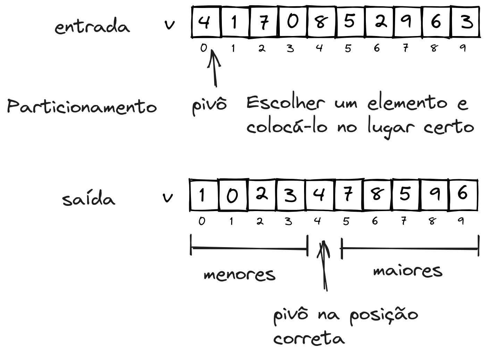

# Quick Sort

O algoritmo do Quick Sort pode ser abordado utilizando divisão e conquista, em que a fase de divisão chamamos de particionamento. Após realizado o particionamento é obtida uma posição chave, em que elementos à esquerda dessa posição são menores que os que estão à direita dessa posição. O elemento que estiver nessa posição chave chamaremos de **pivô**.

Tomemos como exemplo a seguinte entrada:


A partir desta entrada, escolheremos um dos elementos para que seja o pivô. Aqui, escolheremos o elemento mais à esquerda da entrada. Feito isso, realizaremos o processo de [particionamento](#particionamento), que consiste em colocar o pivô em sua posição correta.



Observe que na imagem acima, todos os elemento à esquerda do pivô são menores que ele e os à direita são maiores.

Com isto, o particionamento deixa o pivô escolhido já está em sua posição correta, e pode-se então chamar o quick sort de maneira recursiva nas demais posições do vetor. 

De maneira geral, temos o seguinte algoritmo recursivo:

```javascript
public static void quickSort(int[] v){
    quickSort_(v, 0, v.length-1);
}

public static void quickSort_(int[] v, int ini, int fim){
    int pos_pivot = quickSort_particionamento(v, ini, fim);
    quickSort_(v, ini, pos_pivot-1); //recursão nos elementos antes do pivô
    quickSort_(v, pos_pivot+1, fim); //recursão nos elementos depois do pivô
}
```

```python
def quickSort(v):
    quickSort_(v, 0, len(v)-1):

def quickSort_i(v, ini, fim):
    pos_pivot = quickSort_particionamento(v, ini, fim)
    quickSort_(v, ini, pos_pivot-1) #recursão nos elementos antes do pivô
    quickSort_(v, pos_pivot+1, fim) #recursão nos elementos depois do pivô
```

Uma execução recursiva completa do exemplo pode ser vista de maneira geral a seguir.


## Particionamento


### Naive

De forma a demonstrar um possível tipo de particionamento simplificado, seria utilizar dois vetores auxiliares: um contendo os valores maiores e outro contendo os valores menores que o pivô. 

Esta abordagem poderia ser implementada da seguinte maneira:

```javascript
public static void int quickSortPartNaive(int[] v, int ini, int fim){
    int pivot = v[ini]; //primeiro elemento é o pivot
    int[] aux = new int[fim-ini+1]
    int i=ini, j=fim, pos_pivot, k;
    

    for(k=ini+1;k<=fim;k++){
        if(v[k] <= pivot){
            aux[i] = v[k]; //valores menores ou iguais são copiados para o início
            i++;
        }else{
            aux[j] = v[k]; //valores maiores são copiados para o final
            j--;
        }
    }

    pos_pivot=i; //guarda a posição do pivot
    aux[i] = pivot //copia o pivot para aux
    //copia os valores de volta ao vetor v
    for(k=ini;k<=fim;k++){
        v[k] = aux[k-ini];
    }
    

    return pos_pivot;
}
```

```python
import numpy as np
def quickSortPartNaive(v, ini, fim):
    pivot = v[ini] #primeiro elemento é o pivot
    aux = np.zeros(fim-ini+1)
    i=ini
    j=fim
    
    for k in range(ini+1, fim+1):
        if v[k] <=pivot:
            aux[i] = v[k] #valores menores ou iguais são copiados para o início
            i+=1
        else:
            aux[j] = v[k] #valores maiores são copiados para o final
            j-=1

    pos_pivot=i #guarda a posição do pivot
    aux[pos_pivot] = pivot #copia o pivot para aux
    #copia os valores de volta ao vetor v
    for k in range(ini, fim+1):
        v[k] = aux[k-ini]

    return pos_pivot
```

### Cormen

```javascript
static int quickSortPartCormen(int[] v, int ini, int fim) {
        int pivot = v[fim]; //<- pivô é o último elemento
        int pos_menores = ini - 1; //<- menores ou iguais que o pivô

        for (int i = ini; i < fim; i++) {
            if (v[i] <= pivot) {
                pos_menores++;
                troca(v, pos_menores, i);
            }
        }
        pos_menores++;
        troca(v, pos_menores, fim);
        return pos_menores;
    }
```

```python
def quickSortPartCormen(v, ini, fim):
    pivot = v[fim] #<- pivô é o último elemento
    pos_menores = ini -1 #<- menores ou iguais que o pivô

    for i in range(ini, fim):
        if v[i] <= pivot:
            pos_menores +=1
            troca(v, pos_menores, i)
    pos_menores+=1
    troca(v, pos_menores, fim)
    return pos_menores
```

### Hoare

O particionamento de *Hoare* é o particionamento original do Quick Sort. Seu nome deve-se a seu criador, o cientista da computação britânico [Charles Antony Richard Hoare](https://pt.wikipedia.org/wiki/Charles_Antony_Richard_Hoare). O algoritmo consiste em utilizar dois índices, um a partir da esquerda do vetor e outro a partir da direita. O da esquerda é incrementado até que um valor maior que o pivô seja encontrado, e o índice da direita faz o contrário: é decrementado até encontrar um valor menor que o pivô. Quando os dois índices encontram esses valores, os valores são trocados e o processo se repete. Isto é feito até que os dois índices se encontrem. Quando se encontrarem, esta é a posição do pivô.

```javascript
public static int quickSortPartHoare(int[] v, int ini, int fim){
    pivot = A[ini]
    idx_esq = ini-1;
    idx_dir = fim+1;
    while(true){
        do{
            idx_dir--;
        }while(v[idx_dir]<=pivot);
        do{
            idx_esq++;
        }while(v[idx_esq]>=pivot);
        if(idx_esq<j){
            troca(v,idx_esq,idx_dir)
        }else{
            return idx_dir;
        }
    }
}
```

```python
def quickSortPartHoare(v, ini, fim):
    pivot = v[ini]
    idx_esq = ini-1
    idx_dir = fim+1
    while True:
        idx_dir-=1
        while v[idx_dir] <=pivot:
            idx_dir-=1
        i+=1
        while v[idx_esq] >= pivot:
            idx_esq+=1
        if i<idx_dir:
            troca(v,idx_esq,idx_dir)
        else:
            return idx_dir
```


### Melhores e piores pivôs

Os melhores pivôs a serem utilizados são aqueles que a sua posição final divide a entrada da forma mais equilibrada possível, ou seja, em que o pivô fica na posição central.

Pivôs ruins são aqueles em que a posição correta do pivô divide a entrada da maneira desequilibrada, ou seja, o pivô fica em uma das extremidades.

Algumas maneiras de encontrar pivôs melhores podem ser:
- escolher um elemento em posição aleatória
- observar três elementos do conjunto, e escolher o elemento da mediana destes (valor do meio).

**Exercícios**  
1. Considere como entrada para Quick Sort o vetor com os valores `1,2,3,4,5,6,7,8,9`, e em seguida
    - ordene escolhendo sempre o elemento mais à esquerda como pivô;
    - ordene utilizando o elemento da mediana entre os elementos nas posições ini, fim e o elemento do meio (`(fim-ini)/2+ini`)
    - elabore as árvores de recursão, comparando as ordenações anteriores.

## Tipo de dados genéricos

## Iterativo

## Análise

## Referências

[DEMAINE, Erik; LEISERSON, Charles. Introduction to Algorithms: Lecture 4: Quicksort, Randomized Algorithms. MIT OpenCourseWare. Massachussetts Institute of Technology. MIT, 2005.](https://ocw.mit.edu/courses/6-046j-introduction-to-algorithms-sma-5503-fall-2005/resources/lecture-4-quicksort-randomized-algorithms/)

[WIKIPEDIA. Charles Antony Richard Hoare.](https://pt.wikipedia.org/wiki/Charles_Antony_Richard_Hoare)
