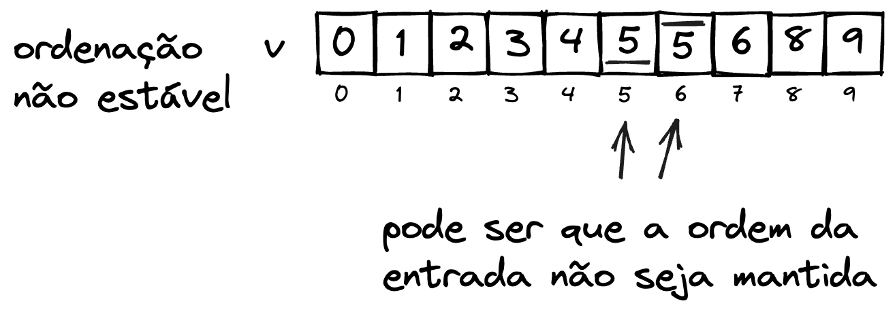

# Ordenação

Alguns princípios

- Se o vetor possui um único elemento, ele já se encontra ordenado.

- Elementos de qualquer tipo podem ser ordenados. Para tal, é necessário que seja possível comparar esses elementos. É comum nas linguagens de programação que uma função de comparação seja passada.

$n$ é o número total de elementos no vetor.

```c
função troca(vetor de inteiro v, inteiro i, inteiro j)
inicio
    inteiro tmp;
    tmp = v[i];
    v[i] = v[j]
    v[j] = tmp
fim;
```

```javascript
public static void troca(int[] v, int i, int j){
    int tmp = v[i];
    v[i] = v[j];
    v[j] = tmp;
}
```


```python
def troca(v, i, j){
    v[i], v[j] = v[j], v[i]
}
```


## Estabilidade

Dizemos que um algoritmo de ordenação é **estável** se ele preserva a ordem de elementos iguais da entrada.

**Exemplo**

Considere dois exemplos de algoritmos abaixo, um estável e um não estável. Observe que na entrada o valor $5$ aparece duas vezes, e para diferenciar, estes estão sinalizados como $\overline{5}$ e $\underline{5}$

- Entrada


- Algoritmo estável
A saída do algoritmo de ordenação estável preserva a ordem sempre, independente da posição em que os elementos elementos de mesmo valor estão. A Figura a seguir ilustra a saída de um algoritmo de ordenação estável.


- Algoritmo não estável
Podem ocorrer situações em que um algoritmo de ordenação estável não preserve a ordem de elementos igual, como indicado na Figura abaixo. Os dados estão ordenados, porém a estabilidade trata de como **elementos de mesmo valor** estão organizados.



## *in place* e *out place*

Os algoritmos de ordenação também podem ser diferenciados pela necessidade de utilização de espaço adicional para ordenação. Algoritmos que permitem ordenar os dados diretamente na mesma estrutura de entrada são definidos como algoritmos *in place* (no lugar), e os que requerem uma estrutura adicional como *out of place* (fora do lugar).