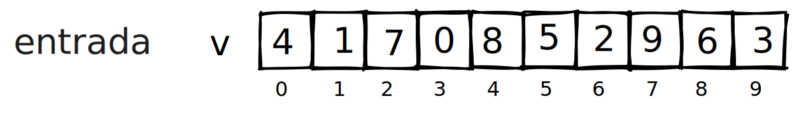
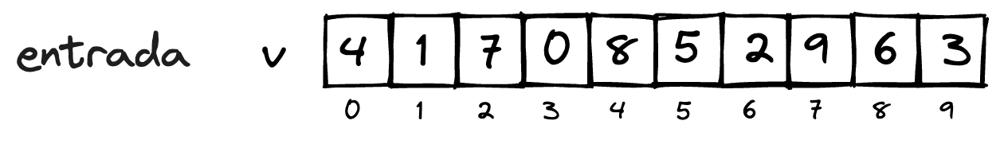
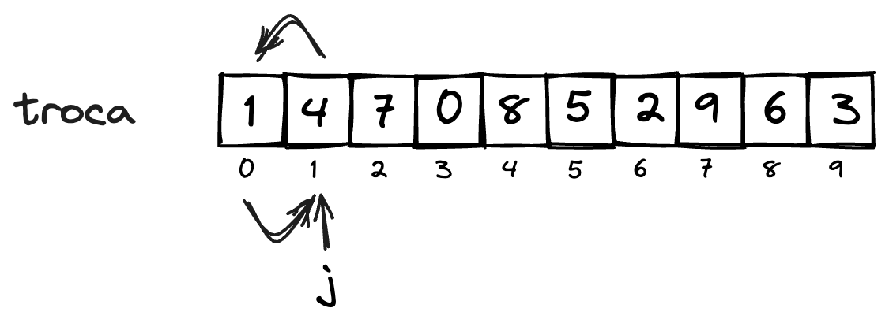
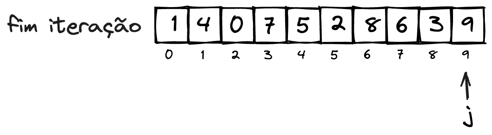

# Bubble Sort

O Bubble Sort, ou algoritmo de ordenação da bolha é um algoritmo que consiste em percorrer o conjunto de dados diversas vezes. Suas características são:
- compara a cada vez dois elementos que estão em sequência;
- percorre o conjunto de dados $n-1$ vezes;
- a cada vez que percorre, envia o maior valor do conjunto para a posição final;
- o algoritmo é *in place*, alterando os dados no própio vetor. com isto, a criação de um novo vetor é dispensada.

**Exemplo** 

Considere o seguinte exemplo, para com conjunto de dados $v$:

<!--  -->


como os elementos a serem comparados devem estar em sequência, podemos comparar o os elementos na posição $j$ com a posição $j-1$, verificando se o valor na posição $j$ é menor que o da posição anterior. Para isto, começaremos com $j$ a partir da posição $1$, evitando possível acesso à posição $-1$. 


caso o valor na posição $j$ seja menor que o valor na posição $j-1$, os valores são trocados.



Se esse processo for repetido com o incremento de $j$ até a última posição do vetor, é garantido que o maior valor presente no vetor esteja na última posição. Ou seja, o maior valor já está na posição correta.




Para realizar este processo é necessário que $j$ seja percorrido da posição $1$ até a última posição (total de elementos $-1$).

Este processo deve ser repetido $n$ vezes, porém como o último elemento já está na posição correta, não é mais necessário que $j$ acesse este elemento. Ou seja, cada vez que este processo se repete, um elemento a menos ao final precisa ser acessado.

```javascript
public static void bubbleSort(int[] v){
    int i, j, n;
    n = v.length;
    for(i=0;i<n;i++){ //percorre de 0 até n-1 (n-1 vezes)
        for(j=1;j<n-i;j++){ //percorre de 1 até n-i
            if(v[j]<v[j-1]){ //verifica se o elem. em j é menor que o elem. em j-1
                troca(v, j, j-1); //caso seja menor, troca os elementos
            }
        }
    }
}
```


```python
def bubbleSort(v):
    n = len(v)
    for i in range(0, n-1):
        for j in range(1, n-i):
            if v[j] < v[j-1]:
                troca(v, j, j-1)
```


## Tipo de dados genéricos

## Recursividade

O Bubble Sort pode ser implementado de maneira recursiva, porém não é recomendado devido grande número de chamadas, podendo facilmente levar a um estouro de pilha. O número de chamadas recursivas no algoritmo é $n-1$.

```javascript
public static void bubbleSortRec(int[] v){
    bubbleSortRec_(v, v.length);
}

public static void bubbleSortRec_(int[] v, fim){
    int j;
    if(fim>1){
        for(j=1;j<fim;ij++){
            if(v[j]<v[j-1]){
                troca(v, j, j-1);
            }
        }
        bubbleSortRec_(v, fim-1);
    }
}
```

```python
def bubbleSortRec(v):
    bubbleSortRec_(v, len(v))

def bubbleSortRec_(v, fim):
    if fim > 1:
        for j in range(1,fim):
            if v[j] < v[j-1]:
                troca(v, j, j-1)
        bubleSortRec_(v, fim-1)
```

## Análise