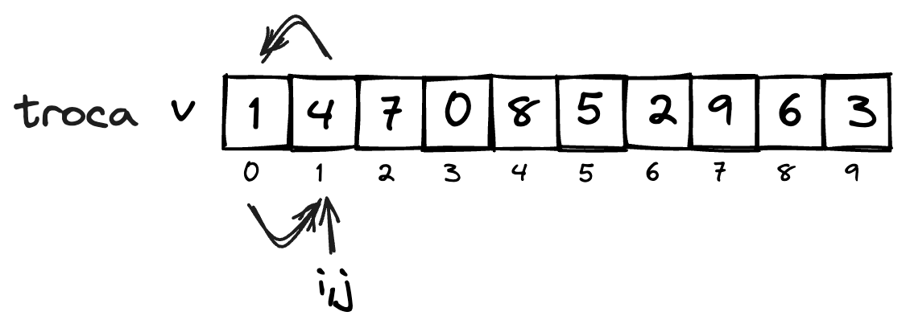
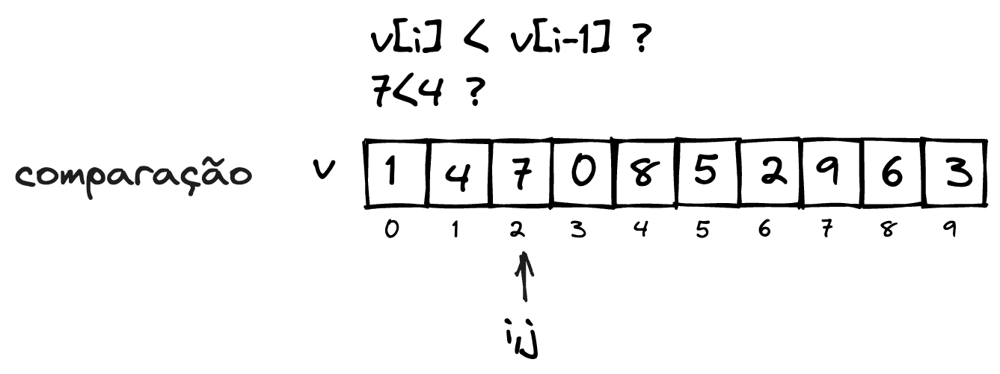
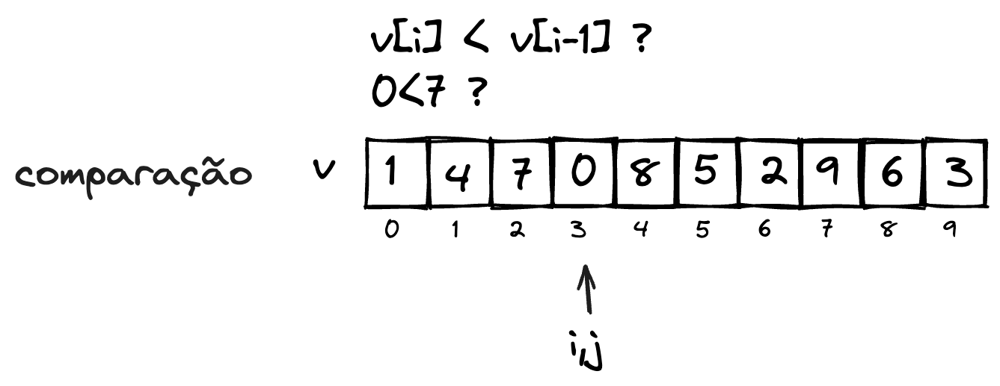
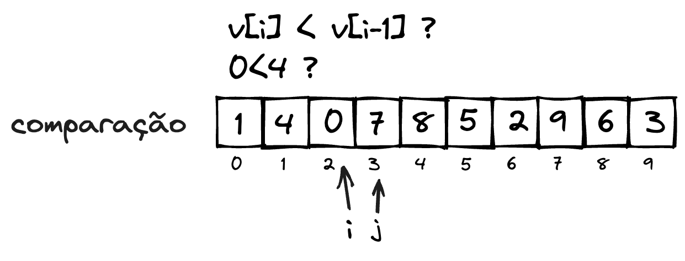
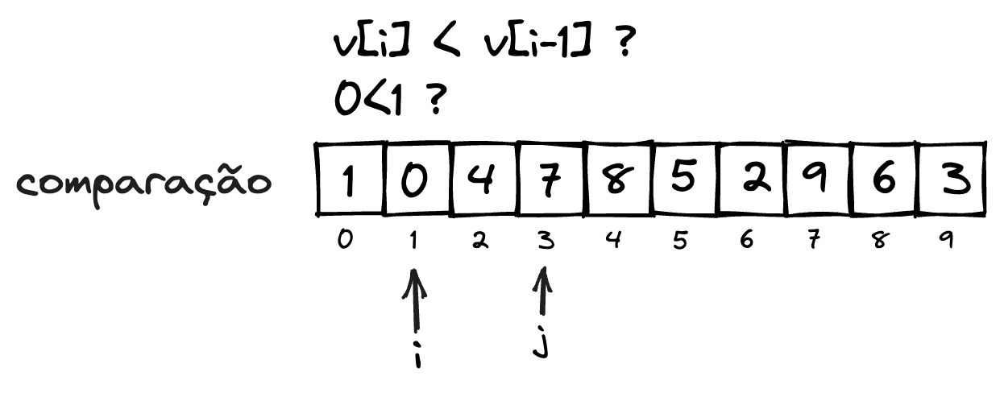
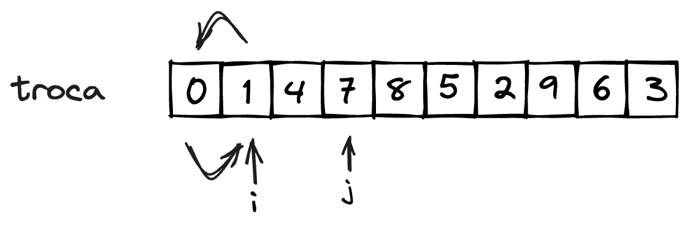

# Insertion Sort

O algoritmo ***Insertion Sort*** consiste em percorrer a entrada da direita para a esquerda. Caso o valor observado seja menor que o valor anterior, estes são trocados, trazendo o valor observado para a esquerda até que o valor da esquerda já não seja menor.


**Exemplo**  

Considere a seguinte entrada:


O valor `j` pode ser percorrido a partir da posição $1$, onde é comparado com o elemento da posição anterior (posição $0$)


caso o valor seja menor que o anterior (que é o caso do exemplo), significa que o elemento que está na posição $j$ está no lugar errado em relação ao anterior, e estes devem ser trocados.



observe que o sub-conjunto compostos pelos elementos das posições $0$ a $j$ está ordenado. Com isto, $j$ avança em um posição, e a comparação se repete.



observe que o elemento na posição $j$ é maior que o da posição $j-1$. Neste caso, nenhuma operação é necessária, visto que o elemento na posição $j$ está na posição correta, em relação ao elemento imediatamente anterior. Com isto, o valor de $j$ é incrementado e avança para o próximo elemento.










```javascript
public static void insertionSort(int[] v){
    int i,j;
    for(j=1;j<v.length;j++){
        i=j;
        while(i>0 && v[i] < v[i-1]){
            troca(v, i, i-1);
            i--;
        }
    }
}
```

```python
def insertionSort(v):
    for j in range(1, len(v)):
        i=j
        while i>0 and v[i] < v[i-1]:
            troca(v, i, i-1)
            i-=1

```

## Tipo de dados genéricos

## Recursividade

O algoritmo do Insertion Sort pode ser implementado também de maneira recursiva, porém não é recomendado devido ao alto número de chamadas, facilmente levando a um estouro de pilha.

```javascript
public static void insertionSortRec(int[] v){
    insertionSortRec_(v, 1);
}

public static void insertionSortRec_(int[] v, end){
    int i = end;
    if(end < v.length){
        while(i>0 && v[i]<v[i-1]){
            troca(v,i,i-1);
            i--;
        }
        insertionSortRec_(v, end+1);
    }
}
```

```python
def insertionSortRec(v):
    insertionSortRec_(v, 1)


def insertionSortRec_(v, fim):
    i = fim
    if fim < len(v):
        while i>0 and v[i]<v[i-1]:
            troca(v, i, i-1)
            i-=1
        insertionSortRec(v, fim+1)
```

## Análise

## Referências

[BRUNET, J.A. Estruturas de dados e Algoritmos: Ordenação por Comparação: Insertion Sort. Notas de aula. Universidade Federal de Campina Grande. Campina Grande, 2019. ](https://joaoarthurbm.github.io/eda/posts/insertion-sort/)