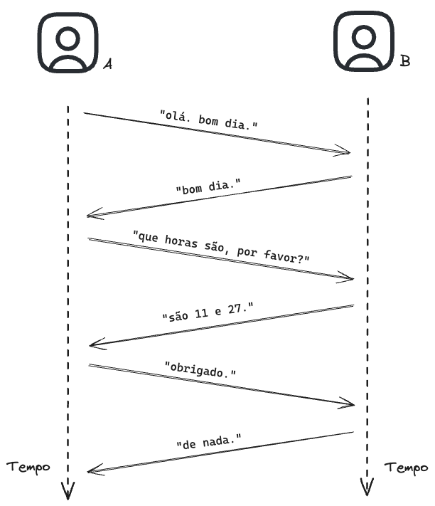

# Protocolos

Um protocolo é um conjunto de regras que definem como será a realizada a comunição entre partes envolvidas.

**Exemplo**  
- Comunicação entre duas pessoas, A e B:
    - A diz: "olá, bom dia."
    - B diz: "bom dia."
    - A diz: "que horas são, por favor?"
    - B diz: "são 11 e 27."
    - A diz: "obrigado."
    - B diz: "de nada."

<!-- marp --- -->

## Modelos de camadas de protocolos

[KUROSE 2013, p.35](https://plataforma.bvirtual.com.br/Leitor/Publicacao/3843/pdf/58)  

- Por que utilizar modelos em camadas?

- Redes são complexas;

- Analogia com correios ou viagem aérea;

- Cada camada possui uma responsabilidade;

- Cada camada se comunica com a camada correspondente remota;

- As regras definidas em cada camada são conhecidas como **protocolos**;

- Vantagens
    - Dividir as tarefas, diminuindo a complexidade;
    - Modularidade, com camadas independentes;

- Modelo OSI
    - Modelo de referência;
- Modelo TCP/IP (Internet)

### OSI

- Aplicação
- Apresentação
- Sessão
- Transporte
- Rede
- Enlace
- Física

### TCP/IP

- Aplicação
- Transporte
- Rede
- Enlace
- Física
    
[KUROSE 2016, p.37](https://plataforma.bvirtual.com.br/Leitor/Publicacao/3843/pdf/60)

## Encapsulamento
- Os pacotes da camada inferior transferem como dados os pacotes da camada superior.  
- O pacote em cada camada tem um nome

[KUROSE 2016, p.40](https://plataforma.bvirtual.com.br/Leitor/Publicacao/3843/pdf/63)

## Referências

[KUROSE, Jim; ROSS, Keith W. Redes de computadores e a internet: uma abordagem top-down. 6.ed. São Paulo: Pearson, 2013. ISBN 9788581436777.](https://plataforma.bvirtual.com.br/Leitor/Publicacao/3843/pdf/) (Link biblioteca online)  

[TANENBAUM, Andrew S; WETHERAL, David. Redes de Computadores. 5.ed. São Paulo: Pearson, 2011. ISBN 9788576059240.](https://plataforma.bvirtual.com.br/Leitor/Publicacao/2610/pdf/17?code=vVkKzoXOaDOskeJv8esK3sZMysyPTg3HtAPyO3xsw/udBb1u+4g3HJxAzSb6zd3SV3dRGINqMpGo2TNJWfLQ8g==)(Link biblioteca online)  

**Outros materiais**  

