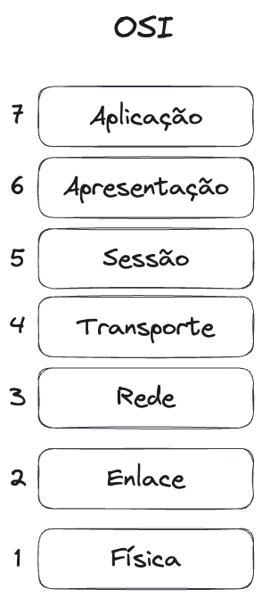

# Modelos de camadas

Os modelos de camadas de protocolos são estruturas conceituais que organizam os diferentes aspectos da comunicação em redes de computadores em uma série de camadas distintas. Cada camada tem uma função específica e se comunica com as camadas adjacentes usando protocolos definidos. Os modelos de camadas são projetados para fornecer uma estrutura modular e abstrata que facilita o projeto, implementação e manutenção de sistemas de comunicação complexos. Dois dos modelos de camadas mais comuns são o Modelo **OSI** (*Open Systems Interconnection*) e o Modelo **TCP/IP**.

Os modelos em camadas servem para definir responsabilidades para os diferentes agentes envolvidos na comunicação entre o remetente e o destinatário de uma mensagem. Podemos fazer uma analogia com o que ocorre nos sistemas de correios. Como exemplo, podemos observar as seguintes responsabilidades no envio de um pacote pelos correios:

- Preparação e Embalagem: Assim como você precisa embalar suas encomendas e colocar etiquetas de remetente e destinatário, as cartas e pacotes são preparados para envio.
- Classificação e Roteamento: Depois que as encomendas são embaladas, elas são encaminhadas para uma central de distribuição, onde são classificadas com base no destino e no tipo de entrega desejada.
- Seleção da Rota: Uma vez classificadas, as encomendas são encaminhadas para as rotas de transporte apropriadas, que podem incluir diferentes modos de transporte, como caminhões, aviões ou navios, dependendo da distância e urgência da entrega. Também podem existir pontos de armazenamento intermediário.
- Entrega e Recebimento: As encomendas são entregues nas agências postais locais, onde são organizadas e entregues aos destinatários finais.
- Verificação e Confirmação: Após a entrega, o destinatário pode assinar um comprovante de recebimento ou confirmar a entrega de outra forma para garantir que a encomenda tenha sido recebida com sucesso.

## OSI

Figura: Camadas do modelo OSI.

O Modelo OSI é composto por sete camadas distintas, numeradas de 1 a 7, que abrangem todas as etapas da comunicação em rede. Essas camadas são:

- Camada de **Aplicação**: Fornece serviços de comunicação de alto nível para aplicativos.
- Camada de **Apresentação**: Responsável pela tradução e formatação dos dados para que possam ser interpretados corretamente pelos aplicativos.
- Camada de **Sessão**: Gerencia as sessões de comunicação entre aplicativos.
- Camada de **Transporte**: Garante a entrega confiável e ordenada de dados entre sistemas finais.
- Camada de **Rede**: Gerencia o roteamento de pacotes entre diferentes redes.
- Camada de **Enlace** de Dados: Responsável pela detecção e correção de erros na transmissão de dados.
- Camada **Física**: Lida com a transmissão de bits por meio de meios físicos.

## TCP/IP