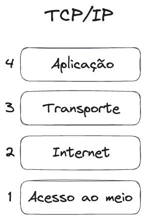

# Modelos de camadas

Os modelos em camadas servem para definir responsabilidades para os diferentes agentes envolvidos na comunicação entre o remetente e o destinatário de uma mensagem. Estes fornecem uma abstração útil, visando possibilitar que diferentes sistemas de comunicação sejam interoperáveis, permitindo que os desenvolvedores se concentrem em implementar funcionalidades específicas em cada camada sem se preocupar com os detalhes de implementação de outras camadas.

Os modelos de camadas de protocolos são estruturas conceituais que organizam os diferentes aspectos da comunicação em redes de computadores em uma série de camadas distintas. Cada camada tem uma função específica e se comunica com as camadas adjacentes usando protocolos definidos. Os modelos de camadas são projetados para fornecer uma estrutura modular e abstrata que facilita o projeto, implementação e manutenção de sistemas de comunicação complexos. Dois dos modelos de camadas mais comuns são o Modelo **OSI** (*Open Systems Interconnection*) e o Modelo **TCP/IP**.

Podemos fazer uma analogia de um modelo de camadas com o que ocorre nos sistemas de correios. Observemos as seguintes responsabilidades no envio de um pacote pelos correios:

- Preparação e Embalagem: Assim como você precisa embalar suas encomendas e colocar etiquetas de remetente e destinatário, as cartas e pacotes são preparados para envio.
- Classificação e Roteamento: Depois que as encomendas são embaladas, elas são encaminhadas para uma central de distribuição, onde são classificadas com base no destino e no tipo de entrega desejada.
- Seleção da Rota: Uma vez classificadas, as encomendas são encaminhadas para as rotas de transporte apropriadas, que podem incluir diferentes modos de transporte, como caminhões, aviões ou navios, dependendo da distância e urgência da entrega. Também podem existir pontos de armazenamento intermediário.
- Entrega e Recebimento: As encomendas são entregues nas agências postais locais, onde são organizadas e entregues aos destinatários finais.
- Verificação e Confirmação: Após a entrega, o destinatário pode assinar um comprovante de recebimento ou confirmar a entrega de outra forma para garantir que a encomenda tenha sido recebida com sucesso.

## OSI

O Modelo OSI é composto por sete camadas distintas, numeradas de 1 a 7, que abrangem todas as etapas da comunicação em rede. Essas camadas são:

- Camada de **Aplicação**: Fornece serviços de comunicação de alto nível para aplicações.
- Camada de **Apresentação**: Responsável pela tradução e formatação dos dados para que possam ser interpretados corretamente pelas aplicações.
- Camada de **Sessão**: Gerencia as sessões de comunicação entre aplicativos.
- Camada de **Transporte**: Garante a entrega confiável e ordenada de dados entre sistemas finais.
- Camada de **Rede**: Gerencia o roteamento de pacotes entre diferentes redes.
- Camada de **Enlace** de Dados: Responsável pela detecção e correção de erros na transmissão de dados.
- Camada **Física**: Gerencia a transmissão de bits passando por meios físicos.

Figura: Camadas do modelo OSI.

O Modelo de Camadas de Protocolos OSI (*Open Systems Interconnection*) é uma estrutura conceitual amplamente utilizada para entender e organizar os diferentes aspectos da comunicação em redes de computadores. Desenvolvido pela International Organization for Standardization (ISO) na década de 1980, o modelo OSI divide o processo de comunicação em redes em várias camadas distintas, cada uma com funções específicas e bem definidas.

Este modelo é composto por sete camadas, numeradas de 1 a 7, e cada uma delas representa uma etapa específica no processo de comunicação. Cada camada se comunica com as camadas adjacentes por meio de interfaces padronizadas e utiliza protocolos definidos para garantir uma comunicação eficiente e confiável.

A primeira camada, conhecida como Camada Física, lida com a transmissão física de dados, como a transmissão de bits por meio de cabos ou ondas de rádio. A Camada de Enlace de Dados é responsável pela detecção e correção de erros na transmissão de dados, bem como pelo controle do fluxo de dados entre dispositivos adjacentes.

A Camada de Rede gerencia o roteamento de pacotes entre diferentes redes, decidindo qual é a melhor rota para enviar os pacotes com base no destino e nas condições atuais da rede. A Camada de Transporte garante a entrega confiável e ordenada de dados entre sistemas finais, dividindo os dados em pacotes menores, se necessário, e retransmitindo pacotes perdidos ou corrompidos.

A Camada de Sessão é responsável por estabelecer, manter e encerrar sessões de comunicação entre aplicativos, enquanto a Camada de Apresentação é responsável pela tradução e formatação dos dados para que possam ser interpretados corretamente pelos aplicativos.

Finalmente, a Camada de Aplicação fornece serviços de comunicação de alto nível para aplicativos, como transferência de arquivos, acesso à web e envio de e-mails.

Em resumo, o Modelo de Camadas de Protocolos OSI fornece uma estrutura abstrata e modular que facilita o projeto, implementação e manutenção de sistemas de comunicação em redes de computadores, promovendo a interoperabilidade e facilitando a resolução de problemas.

## TCP/IP

O Modelo TCP/IP é uma simplificação do Modelo OSI e é amplamente usado em redes modernas, especialmente na Internet. 

Ele consiste em quatro camadas principais:
Camada de Interface de Rede: Equivalente às camadas física e de enlace de dados do Modelo OSI.
Camada de Internet: Responsável pelo roteamento de pacotes IP.
Camada de Transporte: Similar à camada de transporte do Modelo OSI, fornece serviços de transporte confiável ou não confiável.
Camada de Aplicação: Agrupa as funções das camadas de sessão, apresentação e aplicação do Modelo OSI, fornecendo serviços de comunicação de alto nível.

Figura: Camadas do modelo TCP/IP.