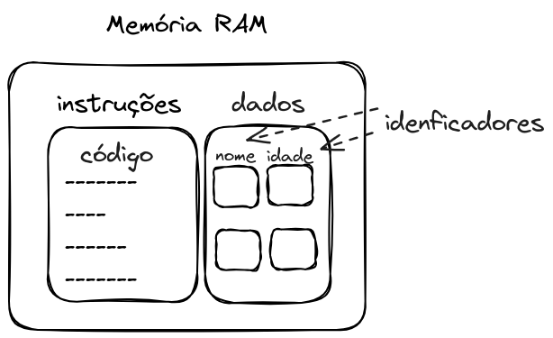

# Variáveis e tipos de dados

Aqui abordaremos as maneiras de organizar e utilizar a memória internamente ao algoritmo. Já tivemos uma noção inicial do seu uso em entrada e saída de dados, e agora observaremos esse ponto mais a fundo.

Os dados fazem parte da matéria-prima básica na execução dos sistemas computacionais. Com eles podemos processá-los, transformálos, armazená-los e apresentá-los, ou seja, as tarefas que um computador é capaz de realizar. Com isto, é de fundamental importância compreender seu funcionamento dentro dos algoritmos.

## Variáveis

Para que um código possa ser executado por um processador, é necessário que ele seja alocado pelo sistema operacional na memória RAM. Um código em momento de execução é chamado de **processo**. A alocação, organização e execução de processos em um sistema computacional é uma das tarefas do sistema operacional.


Quando falamos sobre variáveis, começamos a observar que estes são espaços na memória RAM em que os dados serão armazenados. Tanto o código como as variáveis são armazenados na memória RAM para serem executados pelo processador.


Um valor **variável** é aquele que pode ser modificado no decorrer da execução do algoritmo.

 
**Exemplos**

- Valores indicados pelo usuário
    - Os valores para A e B são 15 e 50
    - O lado do quadrado
- Resultados intermediários de operações matemáticas
- Estado de alguma operação ou ação
    - A janela está aberta
    - A janela está fechada

### Identificadores de variáveis

Um **identificador** de uma variável é um nome, que corresponde a um dado a ser utilizado no algoritmo. Comumente dizemos que um identificador é o **nome da variável**. A escolha do identificador deve sempre ser de acordo com a função da variável no algoritmo, de forma a facilitar o entendimento do código.

Em nossa analogia de gavetas, podemos imaginar que o identificado é um rótulo em cada gaveta, que descreve o que nela contém.




Para criar um identificador, algumas regras devem sempre ser seguidas:  

1. Sempre deve começar com caractere alfabético (a-z, A-Z);  
1. Podem ser seguidos por um ou mais caracteres alfabéticos, numéricos (0-9) ou _underscore_ ( \_ );  
1. Caracteres especiais não podem ser utilizados;
1. Não podem ser utilizadas palavras reservadas da linguagem. A lista de palavras reservadas é específica de cada linguagem.  

**Exemplos**

- Gama
- X
- notas
- soma
- Soma
- SoMA_Total

**Exercício**

- Indique se os identificadores a seguir são válidos ou inválidos
    - 2tempos
    - verdadeiro-ou-falso
    - janela_aberta
    - nome
    - Tamanho do lado
    - area
    - SomaTotal
    - media/2


#### Convenções

Boa parte dos programadores seguem alguma convenção ao definir os identificadores, para que o código seja mais uniforme. Estas práticas costumam facilitar o entendimento do código.

Algumas convenções para identificadores são:

- ***camelCase*** : palavras são escritas juntas sem espaço, e cada palavra inicia com uma letra maiúscula. Exemplos:
    - idDoUsuario
    - idadePessoa
    - nomeFuncionario
- ***snake_case*** : palavras são separadas por *underline* (_) entre elas. Exemplos:
    - id_do_usuario
    - idade_pessoa
    - nome_funcionario

Não existe uma maneira correta de definir os identificadores, porém estas são utilizadas cotidianamente.

### Declaração de variáveis

Já vimos que quando falamos de dispositivos computacionais, as variáveis correspondem a uma área na **memória** para o armazenamento de dados.

É fundamental que o **tipo de dado** de cada **variável** seja observado e utilizado sempre de maneira correta.

Antes de fazer o uso da variável, precisamos declará-la. A declaração da variável serve para informar ao sistema operacional que o algoritmo precisa de memória para armazenar dados para que possa ser executado.

Comumente, colocamos a declaração de variáveis no início do algoritmo.

Na declaração das variáveis é necessário informar qual tipo de dado poderá ser armazenado naquela variável.

**Exemplo**

- declaração de uma variável chamada `idade`, que armazenará valores do tipo inteiro.

  ```javascript
  //variáveis
  int idade;
  ```

#### Atribuição

Dados podem ser atribuídos a variáveis, bem como utilizados em outras partes de um algoritmo. Para atribuir um valor a uma variável, utilizamos um **operador de atribuição**. Este operador é dependente da linguagem que estiver sendo utilizada.

O operador de atribuição é:

  ```javascript
  =
  ```

**Exemplo**

- Uma variável do tipo inteiro chamada `distancia` é criada, e o valor 2000 é atribuído a ela.


```javascript
//variáveis
int distancia;

distancia = 2000; //lê-se "distancia recebe o valor 20000"
```


Após atribuir o valor à variável, este valor fica armazenado na memória RAM no espaço reservado para a execução da aplicação.


#### Substituições

O valor presente em uma variável sempre será o último valor que for atribuído a ela. O valor anterior é perdido.

**Exemplo**

```javascript
//variáveis
int distancia;

distancia = 2000; 
distancia = 1500; //o valor anterior (2000) é perdido

System.out.println("A distância apresentada foi de " + distancia + " metros.");
```

Saída na tela:
```
1500
```

**Exercício**

- Observe o código abaixo, e diga qual será a saída apresentada pelo algoritmo.


```javascript
//variáveis
int distancia;

distancia = 2000; 
System.out.println("A distância inicial foi de " + distancia + " metros.");

distancia = 1500; 
System.out.println("A distância final foi de " + distancia + " metros.");
```


## Tipos de dados

Um tipo de dado pode ser criado a partir de outros tipos de dados. Os tipos de dados iniciais já presentes em uma linguagem de programação são chamados de **tipos primitivos de dados**. Aqui observaremos os tipos de dados **inteiro**, **real**, **caractere** e **lógico**.

### Inteiro

Um **inteiro** é uma informação numérica, que compreende valores que correspondem ao conjunto dos números inteiros (positivos, nulo e negativos)

**Exemplo**  

- O Campus possui 4 construções;
- Estão construindo 22 casas novas no bairro vizinho;
- O cachorro tem 8 anos de idade. 

#### Declaração de uma variável do tipo de dado inteiro

  ```javascript
  int <identificador>;
  ```

  **Exemplo**

  ```javascript
  //variáveis
  int quantidade_de_caixas;
  int numero_de_itens_por_caixa;
  Scanner entrada;

  entrada = new Scanner(System.in);

  quantidade_de_caixas = entrada.nextInt(); //recebe dados da entrada padrão
  numero_de_itens_por_caixa = 50; //atribuição

  System.out.println("Existem " + quantidade_de_caixas + " com " + numero_de_itens_por_caixa + " itens em cada uma."); //envia dados à saída padrão
  ```
  

### Real

O tipo de dado **real** é aquele que possui um valor que está compreendido no conjunto dos números reais. São abordados os números negativos, positivos e nulo, considerando as casas decimais.

**Exemplo**  

- A distância do portão até a sala é de 25,7 metros.
- O saldo bancário é de R\$ 357,32.
- O saldo bancário é de R\$ -169,20.

#### Declaração


```javascript
float <identificador>;
```

**Exemplo**

```javascript
//variáveis
float peso_da_caixa;
float custo_da_caixa;
Scanner entrada;

entrada = new Scanner(System.in);

peso_da_caixa = entrada.nextFloat(); //recebe dados da entrada padrão
custo_da_caixa = 10.50; //atribuição

System.out.println("Uma caixa pesa " + peso_da_caixa + " e seu custo é de R$ " + custo_da_caixa + "."); //envia dados à saída padrão
```


### Lógico

Um dado do tipo **lógico** é aquele em que dois valores podem ser asssumidos: verdadeiro ou falso.

**Exemplo**

- A janela está aberta.
- O carro está ligado.
- A bicicleta está parada.


#### Declaração


  ```javascript
  boolean <identificador>;
  ```

**Exemplo**

```javascript
//variáveis
boolean caixa_vazia;
boolean caixa_nova;
Scanner entrada;

entrada = new Scanner(System.in);

caixa_vazia = entrada.nextBoolean(); //recebe dados da entrada padrão
caixa_nova = false; //atribuição

System.out.println("A caixa está vazia? " + caixa_vazia); //envia dados à saída padrão
System.out.println("A caixa é nova? " + caixa_nova);  //envia dados à saída padrão
```


### Caractere

Os dado do tipo **caractere** são aqueles que pertencem ao conjunto de valores alfanuméricos (0-9), alfabéticos (a-z, A-Z) e especiais (\!\@\#\$\%\*+-/, dentre outros).

**Exemplo**  

- O professor disse: "Não use o celular durante a aula!".
- Ao final do jornal, ele sempre fala "Boa noite".
- O nome do presidente do clube é "Celso da Silva".

### Declaração


```javascript
String <identificador>;
char <identificador>;
```

**Exemplo**

```javascript
//variáveis
boolean caixa_vazia;
boolean caixa_nova;
Scanner entrada;

entrada = new Scanner(System.in);

caixa_vazia = entrada.nextBoolean(); //recebe dados da entrada padrão
caixa_nova = false; //atribuição

System.out.println("A caixa está vazia? " + caixa_vazia); //envia dados à saída padrão
System.out.println("A caixa é nova? " + caixa_nova);  //envia dados à saída padrão
```


**Exercício**  

- Identifique se o tipo de dado de cada variável está correto ou incorreto.
  - inteiro: endereço
  - inteiro: nro_gatos
  - inteiro: qtde_itens
  - real: soma_total
  - inteiro: soma_total
  - caractere: idade
  - lógico: idade

**Exercício**  

- Identifique se o tipo de dado de cada variável está correto ou incorreto.
  - inteiro: idade
  - real: nome
  - lógico: janela_aberta
  - real: peso
  - real: tamanho

